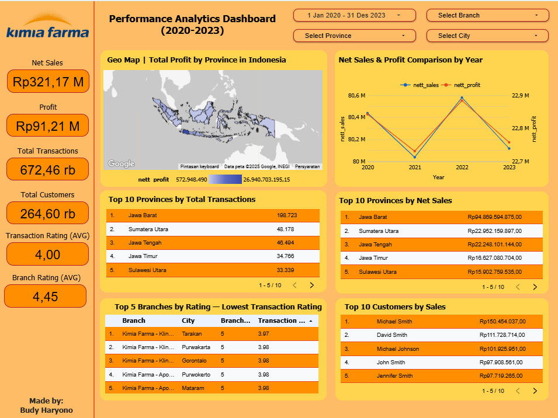

## About The Program
Program **Project-Based Internship** hasil kolaborasi antara **Rakamin Academy** dan **Kimia Farma Big Data Analytics** adalah program pengembangan diri dan percepatan karier yang ditujukan bagi siapa pun yang tertarik mendalami posisi **Big Data Analytics** di Kimia Farma. Program ini memberikan akses ke materi pembelajaran dasar seperti **Article Reviews** dan **Company Coaching Videos** untuk mengenalkan kamu pada kompetensi serta keterampilan yang dibutuhkan oleh profesional **Big Data Analytics** di perusahaan. Selain materi, akan ada penilaian terhadap hasil belajarmu dalam bentuk tugas mingguan (**Weekly Task questions**), yang akan berujung pada pembuatan **Final Project** sebagai portofolio dari program ini.


## About Kimia Farma
Kimia Farma merupakan perusahaan farmasi nasional yang telah beroperasi sejak tahun 1817 dan menjadi bagian dari holding BUMN farmasi Indonesia. Perusahaan ini bergerak di bidang produksi, distribusi, dan layanan kesehatan terpadu, meliputi apotek, laboratorium klinik, serta pabrik produksi skala industri di berbagai wilayah Indonesia.

Saat ini, Kimia Farma mengoperasikan lebih dari 10 pabrik produksi skala industri, 1.200+ apotek, 500+ klinik dan laboratorium, serta jaringan distribusi yang mencakup seluruh 38 provinsi di Indonesia. Selain melayani pasar domestik, Kimia Farma juga telah melakukan ekspor produk farmasi dan kosmetik ke berbagai negara, seperti Malaysia, Singapura, Jepang, dan beberapa negara di Timur Tengah. Perusahaan terus memperkuat transformasi digital dan pemanfaatan big data untuk meningkatkan efisiensi operasional dan daya saing di industri farmasi nasional.

## Objective
Tujuan dari proyek ini adalah untuk mengevaluasi kinerja bisnis **Kimia Farma** dari tahun **2020 hingga 2023**. Saya diminta untuk menyelesaikan serangkaian tantangan yang mencakup proses **mengimpor dataset ke BigQuery**, **membuat tabel analisa**, serta **membangun dashboard di Google Looker Studio**.

## Step-by-step
- **Step 1**: Meng-import dataset (yang disediakan Kimia Farma) ke Google BigQuery. 
- **Step 2**: Membuat tabel analisis di Google BigQuery, tabel baru yang mengombinasikan data dari 4 dataset yang di-import
- **Step 3**: Membuat performance dashboard di Google Looker Studio yang mengvisualisasikan data dari tabel analisis yang telah dibuat di Google BigQuery

## Datasets
Datased terdiri dari data transaksi `kf_final_transaction`, data inventory `kf_inventory`, informasi cabang `kf_kantor_cabang`, dan informasi produk `kf_product`.

## SQL Syntax
Sintaks SQL ini digunakan untuk membuat tabel baru bernama `analisa` di database `kimia_farma`. Tabel baru diisi dengan data yang dipilih dari tabel yang sudah ada (`kf_final_transaction`, `kf_kantor_cabang`, dan `kf_product`).
#### Create Defined Function
```SQL
CREATE OR REPLACE FUNCTION kimia_farma.get_persentase_gross_laba(price FLOAT64)
RETURNS FLOAT64 AS (
  CASE
    WHEN price <= 50000 THEN 0.10
    WHEN price <= 100000 THEN 0.15
    WHEN price <= 300000 THEN 0.20
    WHEN price <= 500000 THEN 0.25
    ELSE 0.30
  END
);
```
Fungsi ini dibuat untuk menghitung persentase laba yang didapat berdasarkan harga produk
#### Create New Table
```SQL
CREATE OR REPLACE TABLE kimia_farma.analisa AS
```
Baris ini membuat tabel baru bernama `analisa` di database `kimia_farma`.
#### Data Selection and Transformation
```SQL
SELECT
  t.transaction_id,
  t.date,
  c.branch_id,
  c.branch_name,
  c.kota,
  c.provinsi,
  c.rating AS rating_cabang,
  t.customer_name,
  p.product_id,
  p.product_name,
  p.price AS actual_price,
  t.discount_percentage,
  kimia_farma.get_persentase_gross_laba(p.price) AS persentase_gross_laba,--persentase laba
  (p.price * (1 - t.discount_percentage)) AS nett_sales, --harga setelah diskon
  ((p.price * (1 - t.discount_percentage)) * kimia_farma.get_persentase_gross_laba(p.price)) AS nett_profit, --keuntungan berdasarkan harga setelah diskon * laba
  t.rating AS rating_transaksi
```
Sintaks `SELECT` mengambil data dari tabel yang dipilih (`kf_final_transaction`, `kf_kantor_cabang`, dan `kf_product`). Sintaks tersebut memilih field spesifik dari tabel-tabel tersebut dan melakukan perhitungan pada beberapa field:
* `persentase_gross_laba` dihitung berdasarkan fungsi `get_persentase_gross_laba`.
* `nett_sales` dihitung berdasarkan rumus `actual_price` * (1 - `discount_percentage`).
* `nett_profit` dihitung berdasarkan rumus `nett_sales` * `persentase_gross_laba`.
#### Data Joins
```SQL
FROM kimia_farma.kf_final_transaction AS t
LEFT JOIN kimia_farma.kf_kantor_cabang AS c
  ON t.branch_id = c.branch_id
LEFT JOIN kimia_farma.kf_product AS p
  ON t.product_id = p.product_id;
```
Sintaks ini menentukan tabel-tabel yang akan digabungkan (`kf_final_transaction`, `kf_kantor_cabang`, dan `kf_product`) serta kondisi untuk menggabungkannya. Proses `JOIN` dilakukan antara `kf_final_transaction` dengan `kf_kantor_cabang` berdasarkan `branch_id`, dan antara `kf_final_transaction` dengan `kf_product` berdasarkan `product_id`.

## Dashboard
Link: [Performance Analytics Dashboard - Kimia Farma](https://lookerstudio.google.com/reporting/5678aa52-387e-4ffb-9a3c-45a7d9196b17)


